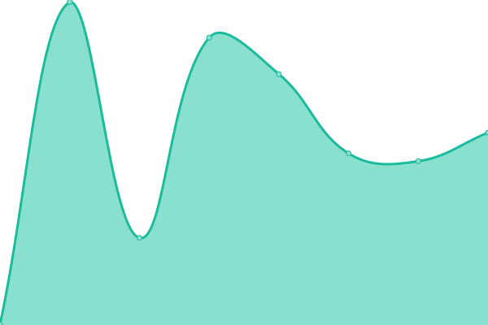
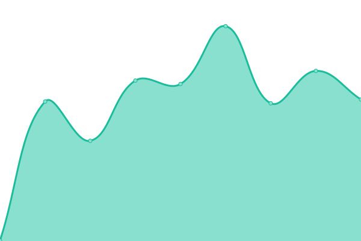
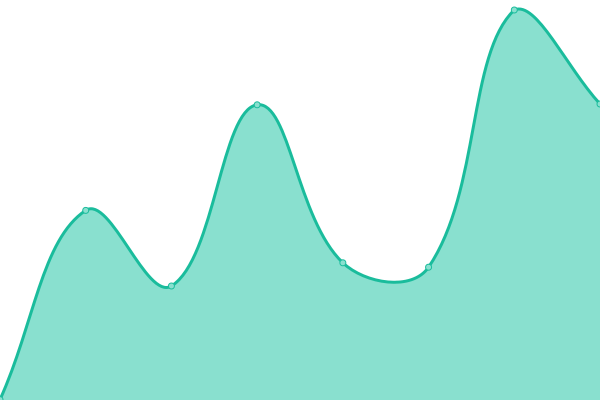
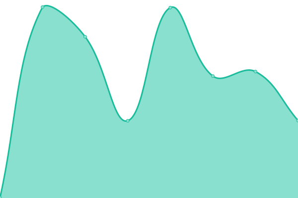

# [📈 Live Status](https://demo.upptime.js.org): <!--live status--> **🟩 All systems operational**

This repository contains the open-source uptime monitor and status page for [Belgrade Center for Digital Humanities](https://demo.upptime.js.org), powered by [Upptime](https://github.com/upptime/upptime).

With [Upptime](https://upptime.js.org), you can get your own unlimited and free uptime monitor and status page, powered entirely by a GitHub repository. We use [Issues](https://github.com/BCDH/upptime/issues) as incident reports, [Actions](https://github.com/BCDH/upptime/actions) as uptime monitors, and [Pages](https://demo.upptime.js.org) for the status page.

<!--start: status pages-->
<!-- This summary is generated by Upptime (https://github.com/upptime/upptime) -->
<!-- Do not edit this manually, your changes will be overwritten -->
<!-- prettier-ignore -->
| URL | Status | History | Response Time | Uptime |
| --- | ------ | ------- | ------------- | ------ |
|  [Хуманистика](https://humanistika.org) | 🟩 Up | [humanistika.yml](https://github.com/BCDH/upptime/commits/HEAD/history/humanistika.yml) | 

 269ms
     
 | 

<a href="https://BCDH.github.io/upptime/history/humanistika">100.00%</a>
    

|  [תּכלית](http://tacheles.humanistika.org) | 🟩 Up | [tacheles.yml](https://github.com/BCDH/upptime/commits/HEAD/history/tacheles.yml) | 

 515ms
     
 | 

<a href="https://BCDH.github.io/upptime/history/tacheles">100.00%</a>
    

|  [Расковник](https://raskovnik.org) | 🟩 Up | [raskovnik.yml](https://github.com/BCDH/upptime/commits/HEAD/history/raskovnik.yml) | 

 474ms
     
 | 

<a href="https://BCDH.github.io/upptime/history/raskovnik">100.00%</a>
    

|  [Препис](http://prepis.org) | 🟩 Up | [prepis.yml](https://github.com/BCDH/upptime/commits/HEAD/history/prepis.yml) | 

 673ms
     
 | 

<a href="https://BCDH.github.io/upptime/history/prepis">100.00%</a>
    

<!--end: status pages-->

[**Visit our status website →**](https://demo.upptime.js.org)

## 📄 License

- Powered by: [Upptime](https://github.com/upptime/upptime)
- Code: [MIT](./LICENSE) © [Anand Chowdhary](https://anandchowdhary.com), supported by [Pabio](https://pabio.com)
- Data in the `./history` directory: [Open Database License](https://opendatacommons.org/licenses/odbl/1-0/)
